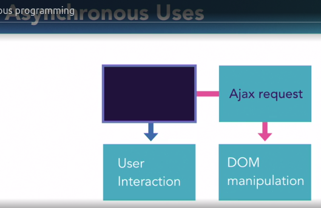
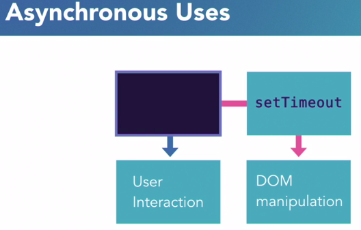

- Synchronous program flow
```
- one statement at a time
- statement executed in order
- blocking (code executed in order, it will not execute ahead code, or they block the ahead code.)
- example --> taking movie ticket at counter in line
```

- Asynchronous program flow
```
- multiple statement at once
- statements executed simultaneously
- non-blockin
- example --> sitting at hotel
```


